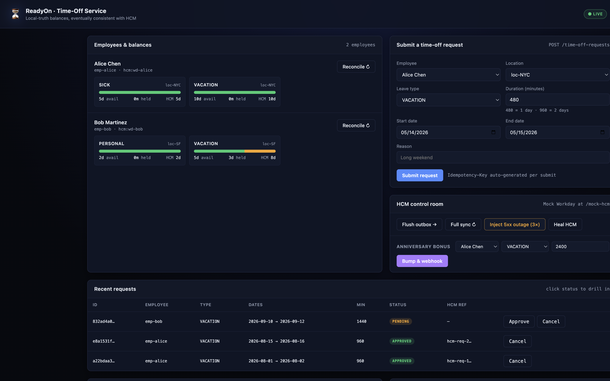

# ReadyOn — Time-Off Microservice

[](https://github.com/Yediiiiiiiii/readyon-timeoff-service/actions/workflows/ci.yml)

A NestJS + SQLite backend that owns the lifecycle of time-off requests for ReadyOn while keeping balances eventually consistent with the customer's HCM (Human Capital Management) system of record (Workday, SAP, BambooHR, …).

> **Read the [TRD](./TRD.md) first.** It explains *why* the system is shaped the way it is — the trade-offs, the failure modes, and the alternatives considered.

---

## What this service guarantees

| Property | Mechanism |
|---|---|
| **No double-spend** under concurrency | `BEGIN IMMEDIATE` SQLite transactions with optimistic versioning on the `balances` row |
| **No request loss** when HCM is down | Outbox pattern — every HCM-bound write is enqueued in the same transaction that mutates the request, then drained with exponential-backoff retry |
| **Self-healing drift** | Periodic full-sync against HCM batch endpoint + inbound webhook + per-employee on-demand reconcile |
| **Auditability** | Append-only `balance_ledger` table with one row per balance change, including `cause`, `actor`, `request_id`, before/after values |
| **Idempotent writes** | `Idempotency-Key` header → `idempotency_keys` table stores response; replays return the original answer; mismatched bodies → `409 IDEMPOTENCY_REPLAY` |
| **Anniversary-safe** | HCM webhooks/reconciles only overwrite `hcm_balance_minutes`; in-flight reservations are preserved unconditionally |
| **Vendor-agnostic** | One `HcmClient` interface; ships `MockHcmService`, `HttpHcmClient`, and Workday + SAP adapter stubs. Swapping vendors is a new file — never a business-logic rewrite. |

## Architecture at a glance

```
┌──────────┐  REST  ┌─────────────────────────────────────────────┐
│ ReadyOn  │ ─────▶ │ Controllers ─▶ Services ─▶ better-sqlite3   │
│ clients  │        │                              │ │            │
└──────────┘        │   ┌──────────────────────────▼─┘            │
                    │   │ employees / balances / requests         │
                    │   │ ledger / outbox / idempotency_keys      │
                    │   └─────────────────────────────────────────┘
                    │             ▲                   ▲           │
                    │             │ outbox flush      │ webhook /  │
                    │             │ (at-least-once)   │ batch pull │
                    └─────────────┼───────────────────┼────────────┘
                                  ▼                   ▼
                            ┌─────────────────────────────────┐
                            │     HcmClient (interface)       │
                            │  - MockHcmService (in-process)  │
                            │  - HttpHcmClient   (any HCM)    │
                            │  - WorkdayHcmClient (stub)      │
                            │  - SapHcmClient     (stub)      │
                            └─────────────────────────────────┘
```

## Quick start

```bash
npm install
npm run start:dev
# → http://localhost:3000        (redirects to /ui/)
# → http://localhost:3000/ui/    (live operator dashboard, see below)
# → http://localhost:3000/docs   (Swagger UI)
# → http://localhost:3000/healthz
```

### Built-in operator dashboard



Open `http://localhost:3000/ui/` in any browser. The dashboard is a single-file
vanilla-JS app that ships with the service and talks to the same HTTP API.
It lets a reviewer:

- Seed Alice + Bob with one click
- Submit a time-off request through a real form (auto-attaches an `Idempotency-Key`)
- Approve / cancel pending requests
- Watch the **outbox** drain (`pending → done`) in real time
- See the **audit ledger** as a colored timeline (`REQUEST_CREATED`, `REQUEST_APPROVED`, `HCM_WEBHOOK`, `HCM_RECONCILE`, …)
- Inject a **5xx HCM outage** and watch the outbox retry, then heal HCM and watch it succeed
- Apply an **anniversary bonus** to HCM and replay the webhook; balances update live without disturbing in-flight reservations

Every action shows the resulting HTTP method/status/latency in the activity log so the dashboard doubles as a live API explorer.

The service ships with an **in-process Mock HCM**, mounted at `/mock-hcm/*`, that holds its own balance state. Production would set `HCM_PROVIDER=workday` (or `sap`, or `http`) and disable the mock.

## End-to-end demo (one command)

```bash
# Terminal A
npm run start:dev

# Terminal B
npm run demo          # runs scripts/demo.sh — full flow with curl
```

What the demo proves, in order: health → seed both ReadyOn and Mock HCM → list balances → create a request with idempotency-key → replay (same response, no duplicate) → manager approve → outbox flush → balance reflects HCM deduction → simulate anniversary bonus + webhook → simulate dropped webhook → full reconcile repairs drift → final balance.

## API surface

### Time-off domain

| Method | Path | Purpose |
|---|---|---|
| `GET`  | `/healthz` | Liveness |
| `GET`  | `/employees/:id/balances` | List an employee's balances per location/leave-type |
| `GET`  | `/employees/:id/balances/:locationId/:leaveType` | Single balance |
| `GET`  | `/employees/:id/time-off-requests` | List requests |
| `GET`  | `/time-off-requests/:id` | Single request |
| `POST` | `/time-off-requests` | Create a request (accepts `Idempotency-Key`) |
| `POST` | `/time-off-requests/:id/approve` | Manager approval |
| `POST` | `/time-off-requests/:id/cancel` | Cancel |
| `POST` | `/webhooks/hcm/balance-updated` | Inbound HCM webhook |
| `POST` | `/admin/sync/full` | Full reconcile against HCM batch |
| `POST` | `/admin/sync/employee/:id` | Reconcile a single employee |
| `POST` | `/admin/outbox/flush` | Manually drain the outbox |
| `POST` | `/admin/seed` | Dev/demo seeding (HCM + ReadyOn in one call) |

### Mock HCM (only when `ENABLE_MOCK_HCM=1`, default in dev)

| Method | Path | Purpose |
|---|---|---|
| `POST` | `/mock-hcm/balances/lookup` | Realtime read for `(employee, location)` |
| `GET`  | `/mock-hcm/balances?cursor=…` | Paginated full corpus |
| `POST` | `/mock-hcm/timeoff` | File a time-off (idempotent on `requestId`) |
| `DELETE` | `/mock-hcm/timeoff/:hcmRequestId` | Cancel a filed time-off |
| `POST` | `/mock-hcm/admin/seed-balance` | Seed a balance |
| `POST` | `/mock-hcm/admin/bump-balance` | Simulate anniversary / HR edit |
| `POST` | `/mock-hcm/admin/failures` | Configure transient/permanent failure modes |
| `POST` | `/mock-hcm/admin/reset` | Wipe state and failure flags |

Errors follow `application/problem+json` shape: `{ type, title, status, code, detail, message }`.

## Configuration

| Env var | Default | Description |
|---|---|---|
| `PORT` | `3000` | HTTP port |
| `DB_PATH` | `:memory:` | SQLite path (use `./data.sqlite` for persistence) |
| `HCM_PROVIDER` | `mock` | `mock` \| `http` \| `workday` \| `sap` |
| `HCM_BASE_URL` | `http://localhost:3000` | Used when `HCM_PROVIDER=http` |
| `ENABLE_MOCK_HCM` | `1` | Mounts `/mock-hcm/*` controllers |
| `OUTBOX_INTERVAL_MS` | `1000` | How often the scheduler drains the outbox |
| `FULL_SYNC_INTERVAL_MS` | `900000` | Periodic full reconcile (15 min) |
| `DISABLE_SCHEDULER` | unset | Set to `1` in tests to drive timing manually |
| `WORKDAY_TENANT_URL` / `WORKDAY_BEARER_TOKEN` | — | Required when `HCM_PROVIDER=workday` |
| `SAP_ODATA_BASE_URL` / `SAP_OAUTH_CLIENT_ID` / `SAP_OAUTH_CLIENT_SECRET` | — | Required when `HCM_PROVIDER=sap` |

## Running tests

```bash
npm test                 # unit + e2e in one Jest run
npm run test:cov         # same, with coverage and threshold gates
npm run test:e2e         # only the e2e spec files
npm run lint             # ESLint
npm run build            # Nest build
```

CI runs build + lint + coverage on every push (`.github/workflows/ci.yml`) on Node 20 and Node 22, uploading the HTML coverage report as an artifact.

### Coverage gates (enforced)

| Metric | Threshold | Achieved |
|---|---|---|
| lines | ≥ 92% | ✓ |
| statements | ≥ 92% | ✓ |
| functions | ≥ 90% | ✓ |
| branches | ≥ 78% | ✓ |

### Test catalogue (115 tests across 18 suites)

| File | What it covers |
|---|---|
| `src/balances/balances.service.spec.ts` | Reserve / release / settle / HCM-update math, ledger writes, anniversary preservation, clamping |
| `src/common/idempotency.service.spec.ts` | Body canonicalisation, replay detection, route-mismatch detection |
| `src/common/errors.spec.ts` | Every domain-error factory has the right HTTP status & code |
| `src/employees/employees.service.spec.ts` | Upsert idempotency, name updates, list ordering, NotFound paths |
| `src/hcm/mock-hcm.service.spec.ts` | Mock semantics, idempotent file/cancel, paged listing, fault-injection knobs |
| `src/hcm/http-hcm.client.spec.ts` | HTTP error classification (5xx → transient, 4xx → permanent, network → transient, 204 → undefined) |
| `src/hcm/adapter-stubs.spec.ts` | Workday + SAP stubs construct correctly and surface `HcmPermanentError` until implemented |
| `src/sync/outbox.service.spec.ts` | Backoff schedule, dead-lettering after max attempts, no-op flush |
| `src/sync/sync.service.spec.ts` | Webhook dedupe & unknown-employee handling, full sync drift repair, per-employee reconcile, new-employee discovery |
| `src/time-off/time-off.service.spec.ts` | Lifecycle: create → approve → flush → settle; cancel paths; HCM disagreement at approve; permanent failure releases reservation |
| `test/time-off.e2e-spec.ts` | Full HTTP happy path, idempotency replay, validation rejection, insufficient-balance |
| `test/concurrency.e2e-spec.ts` | **100 concurrent requests → exactly N succeed where N×duration ≤ balance** |
| `test/hcm-failures.e2e-spec.ts` | Transient HCM during file → eventual success after retries; permanent → request FAILS, reservation released; transient HCM during approve → 503 |
| `test/sync.e2e-spec.ts` | Webhook over HTTP, anniversary bump preserves reservations, full-sync repairs missed-webhook drift |
| `test/api-errors.e2e-spec.ts` | 404s, illegal transitions, list endpoint, admin/sync/employee |
| `test/mock-hcm-http.e2e-spec.ts` | Mock HCM HTTP surface: seed, list, file, cancel, bump, failure injection, reset |
| `test/http-hcm-client.e2e-spec.ts` | `HttpHcmClient` against the live mock HCM HTTP server — full round-trip + classification |
| `test/admin-seed.e2e-spec.ts` | Admin seed endpoint creates a usable dataset; full request flow works against it |

## Project layout

```
src/
  app.module.ts               composition root
  main.ts                     bootstrap (Swagger, validation pipes)
  health.controller.ts
  admin.controller.ts         dev seeding endpoint
  common/                     Clock, IdempotencyService, DomainError
  db/                         DbService (better-sqlite3) + migrations
  domain/                     LeaveType, RequestStatus, row/view types
  employees/                  Employee + Location upserts and lookups
  balances/                   Balance state machine (the heart)
  time-off/                   TimeOffService — request lifecycle
  hcm/
    hcm-client.ts             abstract HcmClient + error types
    mock-hcm.service.ts       in-process default
    mock-hcm.controller.ts    HTTP surface for the mock
    http-hcm.client.ts        generic HTTP adapter
    workday-hcm.client.ts     Workday stub
    sap-hcm.client.ts         SAP SuccessFactors stub
    hcm.module.ts             provider selection by env
  sync/                       OutboxService, SyncService, SchedulerService

test/                         e2e specs + harness
scripts/
  demo.sh                     full curl walkthrough
  demo-seed.json              demo dataset
TRD.md                        Technical Requirements Document
.github/workflows/ci.yml      CI: build + lint + coverage on Node 20/22
```

## Production readiness checklist

This is a v1; before customer-facing deployment we'd need to add (none of which require core changes):

- [ ] Replace SQLite with Postgres (the schema and outbox carry over unchanged).
- [ ] Authentication (JWT/IAM gateway in front).
- [ ] HMAC verification on the inbound HCM webhook.
- [ ] Per-tenant isolation (`tenant_id` everywhere or DB-per-tenant).
- [ ] Real Workday and SAP adapter implementations behind the existing stubs.
- [ ] Prometheus exporter for the metrics described in [TRD §11](./TRD.md#11-observability).
- [ ] Multi-instance outbox claim (e.g., `SELECT … FOR UPDATE SKIP LOCKED`) — currently single-writer.
- [ ] Disable `/mock-hcm/*` and `/admin/seed` in prod (`ENABLE_MOCK_HCM=0`, ops auth in front of `/admin/*`).

## License

UNLICENSED — internal ReadyOn property.
